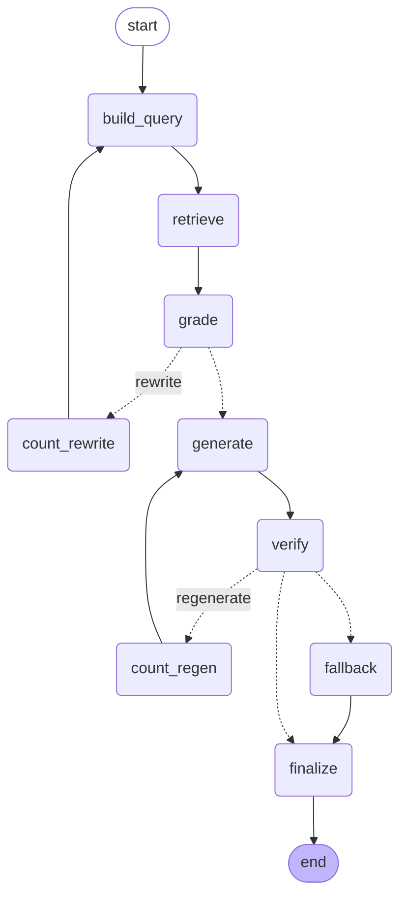

# TawasolPay Cyber Risk Copilot

A pipeline that turns a fintech's raw security data — asset inventory,
open vulnerabilities, threat intel, business-service context — into a
**Top 5 Cyber Risks** briefing: each risk deterministically scored, each
narrative grounded in retrieved NIST SP 800-53 controls, and every citation
verified before it ships.

The core design principle, held everywhere in this codebase: **deterministic
core, agentic edges.** Ranking is arithmetic — pandas joins and a scoring
formula, reproducible byte-for-byte on every run. The LLM only ever narrates
a ranking it was handed; it never decides what ranks where, and a regex
ground-truth check (`agent.py`'s `verify` node) throws out anything it cites
that wasn't actually retrieved.

```bash
pip install -r requirements.txt
streamlit run App.py
```
See [RUN_LOCAL.md](RUN_LOCAL.md) for the full local setup (API keys, tests,
Docker, the individual pipeline-stage scripts).

## How it works


*(The agent graph for stage 5, below — regenerate with `python
scripts/run_stage5.py`, which writes the current version to
`outputs/agent_graph.mmd`.)*

**Stage 1 — Validate** (`src/risk_engine/validate.py`). Every dataset is
checked for referential integrity, value sanity, and — deliberately — four
planted imperfections are surfaced rather than silently fixed: an
exposure-status contradiction between a vulnerability's own `asset_exposure`
and its asset's `internet_exposed` flag; synthetic CVE identifiers that can
never match an external feed like CISA KEV; threat-intel records that don't
match anything in this environment (industry noise); and asset hygiene gaps
(missing EDR, stale assets, ownerless assets). All four show up in the app's
"Data Quality" tab, not swept under the rug.

**Stage 2 — Enrich** (`enrich.py`). One row per open finding, joined against
asset context, business-service context (including dependency fan-in — a
service other services depend on carries extra weight), matched threat-intel
(noise discarded), and CISA KEV status. The exposure contradiction from
Stage 1 is resolved by policy here: worst-case wins (`internet_exposed =
vuln-level OR asset-level`), and the conflict is still flagged for the
record. After this stage every scoring question is a column lookup.

**Stage 3 — Score** (`score.py`). Risk = **likelihood × impact**, not a
flat weighted sum. Likelihood starts from exposure as a gate (an attacker
can't hit what they can't reach — internal findings keep a small floor for
insider/pivot risk but can never outrank an equivalent exposed finding),
layers exploitation evidence (KEV, ransomware association, threat-intel
maturity), and dampens raw CVSS to a tiebreaker rather than a primary
signal. Impact blends asset criticality, revenue impact, compliance scope,
customer-facing status, recovery-time urgency, and data classification, plus
a dependency-cascade bonus and a gateway-asset bonus (VPN/firewall
compromise grants network-wide access, beyond what the owning service's
revenue profile alone implies). Every weight lives in
[`config/weights.yaml`](config/weights.yaml), commented with the reasoning,
not buried in code.

  *Alternatives considered:* a flat weighted sum of the same factors was the
  obvious first design, and was rejected specifically because it fails the
  scenario this project is actually built to get right — a high-CVSS finding
  on unreachable internal infrastructure can "buy back" rank against a
  lower-CVSS finding on exposed, actively-exploited production
  infrastructure just by having enough raw severity. Multiplicative scoring
  makes that impossible by construction (see `scripts/run_stage3.py`'s
  sanity tests T1/T2/T5, which assert exactly this ordering on real rows in
  this dataset), not by tuning weights to happen to produce the right answer
  on today's data.

  *A second pitfall, found and fixed after the fact:* likelihood and impact
  are each a chain of several multipliers, a few of which sit above 1.0
  (e.g. `no_auth_required`, `profile_targeted`, `edr_missing` are >1.0
  bonuses) — so a merely-severe finding can push the raw product past 1.0
  well before reaching the true worst case. Capping each row at a flat 1.0
  there throws away exactly how far past that point it was, which can
  silently invert the ranking between two findings that both cross 1.0 by
  different margins (verified: two real findings in this dataset both read
  as a flat `1.0` under that scheme despite one's uncapped evidence being
  clearly stronger). Both factors are instead normalized against the *true*
  theoretical ceiling — every multiplier at its own maximum, computed from
  `weights.yaml` itself in `_max_likelihood_raw`/`_max_impact_raw`, not a
  hand-picked constant — which preserves that ordering information and
  means a genuine `100` requires every factor maxed simultaneously, not
  just several bad-but-not-worst-case ones stacking past an arbitrary wall.

  Threat-actor and MDR-advisory context (`threat_report.py`) enrich this
  stage too: `get_campaign_excerpt` matches a finding's threat-intel actor
  against the synthetic MDR report's own campaign write-ups, attaching
  richer prose than the CSV's one-line summary — passed through to Stage 5
  as `mdr_excerpt`, with the misattribution risk (an actor linked to more
  than one campaign/CVE) explicitly guarded against in both the generation
  prompt and the `verify` step below.

**Stage 4 — Retrieve** (`nist_catalog.py`, `retriever.py`). NIST SP 800-53
Rev 5 is pulled from NIST's own machine-readable OSCAL catalog (not a
summary CSV, not LLM training memory), chunked at real control-statement
boundaries (58% of controls have 2+ genuinely separate sub-requirements;
AC-2 alone has 21), and indexed two ways: BM25 for the exact-terminology
matches NIST's control language rewards ("flaw remediation", "least
functionality"), and dense embeddings (sentence-transformers + Chroma) to
bridge vocabulary gaps a keyword match misses ("patch the VPN" → SI-2). Both
rankings are fused with Reciprocal Rank Fusion. The dense backend is
optional at runtime — if the embedding model can't load, retrieval degrades
to BM25-only and says so; it never crashes and never silently changes
behavior.

  *What got embedded vs. queried directly:* only the NIST control catalog is
  embedded — it's genuinely unstructured prose that needs semantic search to
  bridge vocabulary gaps. The five structured CSVs (assets, vulnerabilities,
  threat intel, business services, remediation hints) are **not** embedded;
  they're loaded into pandas and queried directly (`loader.py`,
  `enrich.py`). That data is relational, not semantic — "which vulnerabilities
  are on internet-exposed assets" is a join and a boolean mask, not a
  similarity search, and treating it as one would trade deterministic
  correctness for approximate retrieval on data that doesn't need it.
  `remediation_guidance.csv` is used as the assignment intends — "a hint,
  not the answer" — its action vocabulary enriches the retrieval query; it's
  never surfaced as the actual remediation output.

**Stage 5 — Narrate** (`agent.py`). A bounded, self-correcting LangGraph
agent (CRAG/Self-RAG style) builds a query, retrieves, grades its own
retrieval (rewriting the query up to twice if insufficient), generates a
narrative grounded in the graded controls, and **verifies** every claim
against ground truth before it ships: cited control IDs must be a subset of
what was actually retrieved; any CVE mentioned must belong to this finding;
any CVSS or risk-score figure mentioned must match this finding's real
numbers; any named threat actor must actually be associated with this
finding (not just leaking in from a shared MDR excerpt). A failed
verification triggers one regeneration; persistent failure — or no API key
at all — falls back to a deterministic template built from the same
evidence bundle. Every path terminates. The narrative can never cite a
control, reference a CVE, claim a CVSS/risk-score figure, or name a threat
actor that isn't real and specifically tied to this finding. The LLM call
itself is a single provider-agnostic HTTP POST (`llm.py`, no SDK dependency)
that works against any OpenAI-compatible endpoint — OpenAI, Groq, etc. — and
is where optional LangSmith tracing (`LANGSMITH_TRACING=true`) attaches, so
every node above shows up as a labelled span without further code changes.

## Repository layout

```
App.py                     Streamlit UI — renders what the pipeline computes, no logic of its own
src/risk_engine/           The pipeline (loader -> validate -> enrich -> score -> retrieve -> agent)
  observability.py         Logging, in-process metrics, alerting (see below)
config/weights.yaml        Every scoring weight, in one place, commented
data/raw/                  The five source CSVs + the synthetic MDR threat report
data/external/             CISA KEV snapshot, NIST OSCAL catalog snapshot, pre-built NIST chunks
data/chroma/                (gitignored) locally-built vector index — regenerated on first run
scripts/                   One script per pipeline stage/eval tier — see table below
tests/                     pytest suite (50+ tests) — see Testing
outputs/                   Generated reports/artifacts (outputs/traces/ is gitignored)
```

| Script | What it does |
|---|---|
| `run_stage12.py` | Stage 1 (validate) + Stage 2 (enrich); prints the evidence profile |
| `run_stage3.py` | Scores and ranks; runs 7 sanity tests against real rows (the CVSS-vs-exposure ordering, determinism, no-duplicate-CVE, ...) |
| `run_stage4.py` | Builds the NIST index; evaluates retrieval quality against 5 known-answer queries; retrieves for the real top-5 |
| `run_stage5.py` | The full pipeline end-to-end → `outputs/risk_report.md` / `.json` |
| `smoke_llm.py` | One-command live-LLM connectivity + one real risk through the full agent |
| `output_quality.py` | **Eval Tier 1** — cheap, deterministic checks on generated cards (uncited bullets, CVSS-led openings, word budget) targeting issues actually found in real traces, not hypothetical ones |
| `eval_faithfulness_deepeval.py` | **Eval Tier 2** — DeepEval LLM-as-judge faithfulness scoring; costs real money, run deliberately (`requirements-eval.txt`) |
| `run_eval_scenarios.py` | Best-case/worst-case scenario matrix against the live agent, labelled for LangSmith trace inspection |
| `download_traces.py` | Pulls LangSmith run trees to local JSON for offline debugging |

## Testing & CI

```bash
pip install -r requirements.txt -r requirements-dev.txt
pytest                                                # 50+ tests
pytest --cov=risk_engine --cov-report=term-missing    # coverage (98-100% on
                                                        # the pure-logic modules:
                                                        # loader/validate/enrich/score)
ruff check .
```
`tests/conftest.py`'s fixtures build the retriever BM25-only (no
model/network dependency), so the suite is fast and offline-safe.
`.github/workflows/ci.yml` runs lint, tests (Python 3.10 + 3.11), and a
Docker build-only job on every push/PR.

## Docker

```bash
docker build -t cyber-risk-copilot .
docker run -p 8501:8501 --env-file .env cyber-risk-copilot
```
Multi-stage build, non-root user, `/_stcore/health` healthcheck, and the
sentence-transformers embedding model baked in at build time so dense
retrieval doesn't silently degrade on a network-restricted host.
`data/chroma/` and `outputs/` are runtime-generated — mount them as volumes
in production.

## Observability

No external metrics/logging stack is assumed. `src/risk_engine/observability.py`
gives structured logging (`LOG_LEVEL`, `LOG_FORMAT=json|text`), an
in-process metrics registry, and best-effort alerting (`ALERT_WEBHOOK_URL`,
Slack-compatible) on every degradation path this pipeline already knows how
to detect: CISA KEV falling back to the cached snapshot, dense retrieval
becoming unavailable, individual LLM call failures, persistent
citation-verification failure, and a batch's template-fallback rate crossing
50% (the signal that the LLM path is effectively down for that run, not
that one card had a bad day). Visible live in the app's sidebar under
"System health," and in logs/CI output either way.

## Configuration

All scoring weights live in [`config/weights.yaml`](config/weights.yaml),
commented inline with the reasoning (the factor ordering mirrors the MDR
threat report's own prioritization guidance: exposure, active exploitation,
ransomware association, business criticality/compliance, missing
compensating controls). Runtime config is environment variables — see
[`.env.example`](.env.example) for the full list (LLM provider/key/model,
LangSmith tracing, eval judge model, logging, alerting).

## Supporting questions

### 1. The data split

I embedded the NIST 800-53 catalog and nothing else. It's the one piece of
data in this whole project that's genuinely unstructured prose, where a
vulnerability's own name almost never matches the control's actual wording
— "Kong Gateway admin API exposed" and "Boundary Protection" don't share a
single keyword, so you need semantic similarity to connect them at all.

Everything else — the five CSVs — I queried directly with pandas, no
embeddings. "Which vulnerabilities are on internet-exposed assets" is a
join and a boolean mask, not a similarity search. Embedding structured,
relational data like that would have traded exact, auditable answers for
approximate ones, on data that never needed approximating in the first
place.

### 2. Where it goes wrong

**A CSV value that doesn't exactly match a config key just quietly picks a
default — no error, no warning.** The impact score looks up things like
`data_classification` in `weights.yaml`'s mapping table, and a miss falls
straight through to a generic default. I only caught this because I went
and diffed every real value in the CSVs against every key in the config,
and it turned out 18 of the 19 real `data_classification` labels (things
like "Payment Card Data") didn't match anything in the original map. So
every payment-data asset in the dataset was quietly getting scored as if
it held generic internal data instead of the most sensitive tier there is
— which is a genuinely bad thing for a *payments* risk tool to get wrong
silently. I fixed the mapping, but there's still no automated check that
would catch the next one of these. Add a new value to a CSV next month
without updating the config, and it fails the exact same way, silently.

**Our exploitation-evidence layering has a gap we can't fully close.** We
don't just trust CISA KEV — it can never match this dataset's synthetic
CVEs anyway — we also check the internal threat-intel feed. But if a
synthetic CVE is genuinely being exploited and neither source has picked
it up yet, there's nothing left to check against. The system will
confidently say "no known exploit" and just be wrong. This isn't something
I patched after finding it; it's a structural limit — the system can only
know what it's actually been told, and I don't think there's a clean code
fix for that, only better/more intel feeds.

**The safety net that's supposed to catch hallucinated citations can be
tricked by something as dumb as a hyphen.** When I switched the narrator
model to Groq's `gpt-oss-120b`, every single card started failing
verification and falling back to the boring template. Took a while to
track down: that model likes writing "typographically correct" hyphens —
the Unicode kind, not a plain keyboard one — inside the control-ID
citations themselves, so it was writing `[SC‑23.1]` instead of
`[SC-23.1]`. Our regex only recognized a literal ASCII hyphen, so it read
every single citation as blank. The model wasn't hallucinating anything —
our own checker just couldn't see what was right in front of it. Found it
by pulling the actual rejected draft out of LangSmith and comparing it
character by character against what the regex expected. Fixed it by
normalizing hyphen variants before matching, but it's a narrow fix — a
different model could trip the same kind of check with smart quotes or
something else I haven't run into yet.

### 3. One thing I would change

I'd build real retry/backoff around the LLM calls, because I watched this
fail live. I ran the full 5-risk pipeline once and got a warning that 4 of
5 cards had fallen back to the template — an 80% fallback rate, on a model
and prompts I'd already confirmed work fine one at a time. Turned out
Groq's free tier has a per-minute token limit, and this particular model
burns a surprising number of hidden "reasoning" tokens on every call —
enough that running all 5 risks back to back tripped the limit partway
through, and since there was no retry logic, every call after that point
just gave up immediately and fell back. I added a bounded retry
specifically for rate-limit responses and reran the same pipeline — 5/5
llm_grounded, no fallback. That part was easy once I saw it: a clearly
labeled error, a `Retry-After` header, done. What I'd actually spend the
extra day on is the broader version of this problem — right now a slow
response, a network blip, or any other transient failure all get treated
identically to "give up right now," when a real retry/backoff layer
across every LLM call (not just the 429s) is what would actually make this
robust enough to leave running unattended.

## What's genuinely production-ready here, and what isn't

The pipeline logic (Stages 1-5) is built to real engineering standards:
deterministic scoring with sanity tests against known scenarios, graceful
degradation on every external dependency (KEV feed, embedding model, LLM
endpoint), a hallucination-containment guarantee that's actually verified
rather than asserted, a real test suite, CI, a Dockerfile, and the
observability layer described above.

What's still missing before this is a deployable multi-user production
system, in priority order:

1. **Authentication/authorization.** The app has none — anyone with the URL
   sees real vulnerability, asset, and business-impact data. Needs SSO/OAuth
   or a reverse-proxy auth layer before it's anything but a local demo.
2. **A real secrets manager.** `.env` + a sidebar text box is fine for a
   laptop; production needs Vault/cloud secrets manager + no plaintext key
   material on disk.
3. **A database.** Source of truth is flat CSVs + a local Chroma SQLite
   file — no concurrent-write safety, no migrations, no backup/DR story.
4. **Rate limiting / cost controls** on LLM calls, and **retry/backoff**
   (not just fallback) on the external HTTP calls in `kev.py` and
   `nist_catalog.py`.
5. **An API layer.** Everything is Streamlit-only; nothing else can consume
   `risk_engine` programmatically, and Streamlit's single-process-per-tab
   model doesn't horizontally scale the way an API + separate frontend
   would.

None of this is hidden — it's the honest gap between "a well-engineered
pipeline" and "a multi-tenant production service," and worth stating
explicitly rather than implying either more or less maturity than what's
actually here.

One more gap in that same spirit: this working tree isn't a git repository
yet (no commits, no remote), so `.github/workflows/ci.yml` above describes
what CI will run once it's pushed somewhere — it hasn't actually executed
yet. `git init` + a first commit + pushing to a GitHub remote is what turns
that from a config file into an active check.
